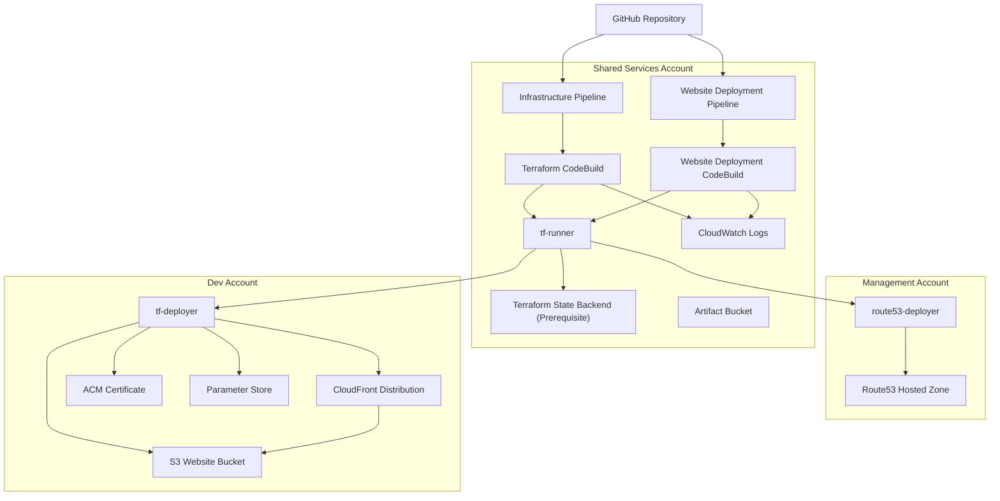

# 👨‍👩‍👧‍👦 AWS Multi-Accounts and S3 Website Platform with Terraform & CI/CD

## 📖 Project Overview

This project demonstrates a real-world AWS multi-account architecture using Terraform, AWS CodePipeline, AWS CodeBuild, and AWS IAM cross-account roles.

The solution provisions and deploys a static website hosted on Amazon S3 and Amazon CloudFront while following AWS multi-account best practices.

The project separates:

- Platform infrastructure (CI/CD, IAM, backend state)
- Application infrastructure (S3, CloudFront, ACM, Route53)
- Application content deployment

into distinct deployment workflows.

The environment consists of three AWS accounts:

| AWS Account | Purpose |
|------------|-----------|
| Management | Identity Center, Route53 Hosted Zones |
| Shared | Terraform backend, CodePipeline, CodeBuild |
| Dev | Website Infrastructure |

---

# 💼 Business Problem Solved

In many organizations:

- Infrastructure is manually deployed.
- Cloud resources are managed from a single account.
- Deployments are inconsistent across environments.
- Changes are not auditable.

This project solves these problems by:

- Centralizing CI/CD operations in a Shared Services account.
- Separating infrastructure and application deployments.
- Using Terraform for Infrastructure as Code.
- Using cross-account IAM roles instead of shared credentials.
- Providing repeatable and auditable infrastructure deployments.

---

# 🏛️ AWS Architecture Diagram


---

# 🏢 Account Ownership

| Account | Resources |
|----------|----------|
| 🏛️ **Management Account** | • Route53 Hosted Zone<br>• route53-deployer Role |
| ⚙️ **Shared Services Account** | • Terraform State Backend<br>• CodePipeline<br>• CodeBuild<br>• Artifact Bucket<br>• CloudWatch Logs<br>• tf-runner Role<br> • Systems Manager Parameter Store |
| ☁️ **Dev Account** | • S3 Website Bucket<br>• CloudFront Distribution<br>• ACM Certificate<br>• Systems Manager Parameter Store<br>• tf-deployer Role |
---

# 🔄 CI/CD Workflow Diagram

```text
                           GitHub Repository
                                    │
            ┌───────────────────────┴────────────────────────┐
            │                                                │
            ▼                                                ▼

    Infrastructure Pipeline                    Website Deployment Pipeline
    ───────────────────────                    ───────────────────────────

        AWS CodePipeline                           AWS CodePipeline
                │                                          │
                ▼                                          ▼
      Terraform CodeBuild                    Website Deployment CodeBuild
                │                                          │
                ▼                                          ▼
         Assume tf-runner                         Assume tf-runner
                │                                          │
                ▼                                          ▼
        Assume tf-deployer                      Assume tf-deployer
                │                                          │
                ▼                                          ▼
          Terraform Apply                    Retrieve SSM Parameters
                │                                          │
                ▼                                          ▼
      Create / Update Resources             Upload Website Files to S3
                │                                          │
                ▼                                          ▼
    ├── S3 Website Bucket                    CloudFront Invalidation
    ├── CloudFront Distribution                            │ 
    ├── ACM Certificate                                    ▼
    ├── Route53 Records                             Website Updated
    └── SSM Parameters
```

---

## 📝 Detailed CI/CD Workflow Explanation

  ### 🏗️ Infrastructure Deployment Pipeline

The infrastructure pipeline provisions AWS resources through Terraform.

Workflow:

```text
GitHub Commit
      ▼
CodePipeline Trigger
      ▼
CodeBuild Terraform Project
      ▼
Assume tf-runner
      ▼
Terraform Execution
      ▼
Assume tf-deployer
      ▼
Provision Resources
```

Resources created:

- S3 Website Bucket
- CloudFront Distribution
- Route53 DNS Records
- Parameter Store Parameters

---

  ### 📦 Website Deployment Pipeline

The application deployment pipeline deploys website content.

Workflow:

```text
GitHub Commit
      ▼
CodePipeline Trigger
      ▼
CodeBuild Deployment Project
      ▼
Assume tf-runner
      ▼
Assume tf-deployer
      ▼
Upload Files to S3
      ▼
Invalidate CloudFront Cache
```

Resources affected:

- Website content files
- CloudFront cache

Infrastructure is not modified.

---

# 📐 Infrastructure & Design

## 🏗️ Bootstrap Layer

Creates foundational resources:

```text
bootstrap/
├── tf-runner
├── tf-deployer
├── route53-deployer
├── CodeBuild Role
├── CodePipeline Role
├── CodeBuild Projects
├── CodePipelines
├── SSM Parameters(TF variables) 
└── Artifact Bucket
```

Bootstrap is executed manually.

---

## 🌐 Infrastructure Layer

Creates application infrastructure:

```text
website-infra/
├── S3 Bucket
├── CloudFront
├── ACM
├── Route53
└── SSM Parameter(CloudFront Distribution ID)
```

Managed by Terraform.

---

## 📁 Application Layer

Contains website content:

```text
website/
├── index.html
├── css
├── js
└── images
```

Managed by deployment pipeline.

---

# 🚀 Deployment Flow

## 🏗️ Initial Platform Setup

Performed one time to establish the CI/CD foundation.

```text
Local Machine
      │
      ▼
Terraform Apply (Bootstrap)
      │
      ▼
Create Shared Services Resources
      │
      ├── Artifact Bucket
      ├── SSM Parameters(TF variables)
      ├── CodePipeline
      ├── CodeBuild
      ├── CodeBuild-role
      ├── Codepipline-role
      ├── tf-runner
      ├── tf-deployer
      └── route53-deployer
```

## 🔄 Infrastructure Deployment Flow
```text
GitHub Commit (Infrastructure Changes)
                │
                ▼
        CodePipeline
                │
                ▼
 Terraform CodeBuild Project
                │
                ▼
       Assume tf-runner
                │
                ▼
      Retrieve SSM Parameters(TF variables)
                │
                ▼
 Terraform AssumeRole
                │
                ▼
          tf-deployer
                │
                ▼
Create / Update Resources
                │
                ├── S3 Bucket
                ├── CloudFront
                ├── ACM
                ├── Route53
                └── SSM Parameter(CloudFront Distribution ID)
```
---

# 🎯 Key Learning Concepts

This project demonstrates:

## 🏢 AWS Multi-Account Architecture

- Account isolation
- Shared services strategy
- Cross-account deployments

## 🧱 Infrastructure as Code

- Terraform remote backend
- Terraform modules
- State management

## 🔐 IAM Cross-Account Roles

- Trust policies
- AssumeRole
- Least privilege principles

## 🔄 CI/CD Design

- CodePipeline
- CodeBuild
- GitOps workflow

## 🌎 Networking & CDN

- CloudFront
- ACM
- Route53

---

# ✨ Features

✅ Multi-Account AWS Architecture

✅ Infrastructure as Code

✅ Cross-Account IAM Roles

✅ Centralized CI/CD

✅ Separate Infrastructure Pipeline

✅ Separate Application Deployment Pipeline

✅ Terraform Remote State

✅ CloudFront Cache Invalidation

✅ ACM Certificate Automation

✅ Route53 DNS Automation

✅ SSM Parameter Store Integration

---

# 🔮 Possible Improvements

Future enhancements:

### 🔒 Security

- Least privilege IAM policies
- KMS encryption
- S3 bucket policies
- WAF integration

### 🚀 CI/CD

- Terraform Plan approval stage
- Manual approval stage
- Branch-based deployments

### 🏗️ Infrastructure

- Multi-environment deployment
- Dev / Test / Prod accounts
- Blue/Green deployments

### 📊 Monitoring

- CloudWatch dashboards
- CloudWatch alarms
- SNS notifications

### 📋 Governance

- SCP implementation
- AWS Config
- Security Hub

---

# 🛠️ Technologies Used

## ☁️ AWS Services

- AWS Organizations
- IAM
- IAM Identity Center
- S3
- CloudFront
- Route53
- ACM
- Systems Manager Parameter Store
- CodePipeline
- CodeBuild
- CloudWatch Logs

## 🧱 Infrastructure

- Terraform

## 🌿 Source Control

- Git
- GitHub

---

# 📈 Architecture Evolution

## 1️⃣ Version 1

Single Account

```text
AWS Account
 ├── S3
 ├── CloudFront
 └── Terraform
```

Problems:

- No separation of duties
- Difficult governance

---

## 2️⃣ Version 2

Multi-Account

```text
Management
Shared
Dev
```

Benefits:

- Better isolation
- Improved security

---

## 3️⃣ Version 3

Centralized CI/CD

```text
Shared Account
 ├── Remote Terraform Backend
 ├── CodePipeline
 ├── CodeBuild
 └── tf-runner
```

Benefits:

- Consistent deployment model
- Centralized control

---

## 4️⃣ Version 4

Separated Pipelines

```text
Infrastructure Pipeline
Application Pipeline
```

Benefits:

- Faster deployments
- Reduced Terraform execution

---

# 📚 Lessons Learned

## ⚠️ Terraform Profiles Break in CodeBuild

Initially:

```hcl
profile = "shared"
```

worked locally but failed inside CodeBuild.

Solution:

```text
Use IAM Roles
Use STS AssumeRole
Avoid AWS profiles in Terraform
```

---

## 🔑 Cross-Account AssumeRole Requires Two Permissions

Both are required:

1. Trust Policy
2. IAM Permission Policy

Missing either causes:

```text
AccessDenied: sts:AssumeRole
```

---

## 🗄️ Terraform Backend Must Exist First

Remote state buckets must be created before they can be used as Terraform backends.

---

## 🌎 CloudFront Uses ACM in us-east-1

Certificates for CloudFront must be provisioned in:

```text
us-east-1
```

regardless of the primary deployment region.

---

# 🐛 Debugging Notes

## ❌ Terraform Profile Errors

Issue:

```text
failed to get shared config profile
```

Cause:

```hcl
profile = "shared"
```

inside Terraform.

Fix:

Remove profile configuration and use IAM roles.

---

## ❌ AccessDenied AssumeRole

Issue:

```text
AccessDenied: sts:AssumeRole
```

Fix:

Verify:

- Role trust policies
- IAM permissions
- Account IDs
- Correct role ARN

---

## ❌ CloudWatch Logs Not Destroyed

Issue:

CloudWatch Log Group remained after Terraform destroy.

Cause:

CodeBuild auto-created the log group.

Fix:

Manage the log group through Terraform.

---

# 🚦 How to Run This Lab

## ✅ Prerequisites

- AWS Organization
- AWS Identity Center
- AWS Accounts
  - Management Account
  - Shared Services Account
  - Dev Account
- Domain Name
- Route53 Zone ID
- A certificate in us-east-1
- s3 backend bucket to store terraform state file in Shared Services Account
- AWS codeconnections - GitHub
- 2 GitHub Repositories
  - terraform code repo (empty repo)
  - wbesite content repo (index.html)
- Terraform CLI
- AWS CLI
- Git CLI


---

## 1️⃣ Step 1 - Make sure you setup three AWS Proiles
  - example
```aws_profile
[sso-session my-sso]
sso_start_url = https://ssoins-123456789123456.portal.us-west-1.app.aws
sso_region = us-west-1
sso_registration_scopes = sso:account:access

[profile shared]
sso_session = my-sso
sso_account_id = 131912101234
sso_role_name = AdministratorAccess
output = json

[profile management]
sso_session = my-sso
sso_account_id = 774305601234
sso_role_name = AdministratorAccess
output = json

[profile dev]
sso_session = my-sso
sso_account_id = 20986681234 
sso_role_name = AdministratorAccess
output = json

```
---

## 2️⃣ Step 2 - Clone the project repo
```
git clone https://github.com/phyomauk/terraform-s3-static-website.git
```
---

## 3️⃣ Step 3 - Create terraform.tfvars files
phase1_bootstrap/terraform.tfvars
 - example:

```text
region = "us-west-1"

dev_account_id = "209866811234"

management_account_id = "774305601234"

shared_account_id = "131912101234"

bucket_name = "<give-a-unique-name terraform will create a s3 bucket>"

terraform_state_bucket_name = "<s3 bucket that you created in shared account to store terraform state file>"

codeconnections_id = "<GitHub codeconnections that you created in shared account>"

artifact_bucket_name = "<give-a-unique-name terraform will create a s3 bucket>"

repo_owner = "perhaps_your_name"

repo_name = "index_html_repo"

repo_name = "the_empty_repo"

```
phase2_infra/terraform.tf.vars
  - exmaple:

```text
region = "us-west-1"

bucket_name = "the same bucket name that you have given above section"

domain_name = "your-domain.com"

www_domain_name = "www.your-domain.com"

route53_zone_id = "Z05394043K4G3LXTX33B5"

dev_account_id = "209866811234"

management_account_id = "774305603238"

```

---

## 4️⃣ Step 4 - Push terraform codes to your blank repo
 - push all codes to your empty repo
```bash
git add .
git commit -m "deploy infra"
git push 

```
---

## 5️⃣ Step 5 - Deploy Bootstrap

```bash
cd phase1_bootstrap

terraform init

terraform apply
```

Creates:

- tf-runner role
- tf-deployer role
- route53-deployer role 
- codepipline role
- codebuild role
- 2 CodePipelines
- 2 CodeBuilds

---

## 6️⃣ Step 6 - Deploy Infrastructure (Automation)
 - codebuild automatically deploy infrastructure 
```text
codepipeline
  -> codebuild deploys infrastructure

```

Creates:

- S3
- CloudFront
- ACM
- Route53
- Parameter Store

---

## 7️⃣ Step 7 - Configure GitHub Source

Connect:

```text
GitHub
  -> CodePipeline
```

Validate pipeline triggers.

---

## 8️⃣ Step 8  - Deploy Website

Push website content to your GitHub repo:

```bash
git add .
git commit -m "deploy website"
git push

```

Pipeline deploys:

- Website Files
- CloudFront Invalidation

---

## 9️⃣ Step 9  - Destroy Infrastructure

1. Destroy application infrastructure:

***use shared profile since tf_runner role is owned by shared account***
```bash
cd phase2-infra

AWS_PROFILE=shared terraform init
AWS_PROFILE=shared terraform destroy

```

2. Destroy bootstrap resources:

```bash
cd phase1_bootstrap

terraform destroy

```

Perform destroys in the above order.